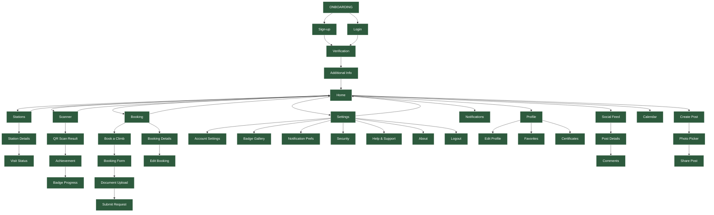

# Mt. Hamiguitan TrekScan+ UX Sitemap

## Overview
The Mt. Hamiguitan TrekScan+ UX Sitemap is a blueprint of navigation that displays all major screens and content areas of the mobile application, including their hierarchical relationship. The map is organized around three main flows: the initial **Account Access sequence** (Onboarding, Login, Signup, and Verification), the central **Core Trek Features hub** (Home, Stations, Scanner, Booking, Settings), and distinct **Social & Profile Areas** (Posts, Comments, Achievements, Certificates). This clear structure visualizes the complete user journey, from a new user registering to an established trekker navigating the application's comprehensive trek management and social features.

---

## Visual Navigation Flow



---

## Hierarchical Screen Structure

### **Account Access Sequence**
```
┌─────────────┐    ┌─────────────┐    ┌─────────────┐    ┌─────────────┐
│ ONBOARDING  │───▶│   Sign-up   │───▶│Verification │───▶│Additional   │
│             │    │             │    │             │    │Info Screen  │
└─────────────┘    └─────────────┘    └─────────────┘    └─────────────┘
       │                  │                                       │
       └──────────────────▼───────────────────────────────────────┘
                    ┌─────────────┐
                    │    Login    │
                    │             │
                    └─────────────┘
```

### **Core Trek Features Hub**
```
                            ┌─────────────┐
                            │    Home     │◀────────── Central Hub
                            │             │
                            └──────┬──────┘
                                   │
        ┌──────────────────────────┼──────────────────────────┐
        │                          │                          │
┌───────▼───────┐          ┌───────▼───────┐          ┌───────▼───────┐
│   Stations    │◀────────▶│    Scanner    │◀────────▶│   Booking     │
│               │          │               │          │               │
└───────────────┘          └───────────────┘          └───────────────┘
        │                                                      │
        ▼                                                      ▼
┌───────────────┐                                    ┌───────────────┐
│Station Details│                                    │Book a Climb   │
└───────────────┘                                    └───────────────┘
```

### **Social & Profile Areas**
```
┌─────────────┐    ┌─────────────┐    ┌─────────────┐
│   Profile   │───▶│Edit Profile │    │   Social    │
│             │    │             │    │   Feed      │
└─────┬───────┘    └─────────────┘    └──────┬──────┘
      │                                       │
      ▼                                       ▼
┌─────────────┐                         ┌─────────────┐
│ Favorites   │                         │Post Details │
└─────────────┘                         └──────┬──────┘
      │                                        │
      ▼                                        ▼
┌─────────────┐                         ┌─────────────┐
│Certificates │                         │  Comments   │
└─────────────┘                         └─────────────┘
```

### **Settings Configuration**
```
┌─────────────┐
│  Settings   │──┬──▶ Account Settings
│             │  ├──▶ Badge Gallery
└─────────────┘  ├──▶ Notification Prefs
                 ├──▶ Security
                 ├──▶ Help & Support
                 ├──▶ About
                 └──▶ Logout
```

---

## Key Navigation Flows

### **🎯 Primary User Journey: New Trekker**
```
Onboarding → Sign-up → Verification → Additional Info → Home → Calendar → Book Climb → Scanner → Achievement
```

### **🎯 Returning User Journey: Social Engagement**
```
Home → Social Feed → Like/Comment → Profile View → Create Post → Share Achievement → Notifications
```

### **🎯 Trek Day Journey: Station Discovery**
```
Scanner → QR Scan → Station Details → Badge Unlock → Progress Update → Social Share → Profile Update
```

### **🎯 Management Journey: Account Control**
```
Settings → Account Settings → Security → Notification Prefs → Badge Gallery → Profile → Logout
```

---

## Screen Relationships & Navigation Rules

### **Always Accessible** (Bottom Navigation)
- **Home** - Central hub with calendar and social feed
- **Stations** - Trek route and discovery features  
- **Scanner** - QR code scanning with geofencing
- **Booking** - Trek reservations and management
- **Settings** - Account and app configuration

### **Contextual Access** (Modal/Sheet Overlays)
- **Create Post** - FAB from Home
- **Booking Form** - FAB from Booking tab
- **Comments** - Bottom sheet from social posts
- **Profile Edit** - From Settings or Profile tap
- **Station Details** - From Station list items

### **Deep Navigation** (Multi-level flows)
- **Booking Management**: List → Details → Edit → Submit
- **Social Interaction**: Feed → Post → Comments → Profile
- **Achievement System**: Scan → Unlock → Progress → Share
- **Account Setup**: Settings → Security → Profile → Preferences

---

## User Access Patterns

### **🟢 Trekkers Only** (Authenticated Users)
All core features require authentication and email verification for full access to trek booking, social features, and achievement tracking.

---

*This sitemap provides a comprehensive navigation blueprint for the Mt. Hamiguitan TrekScan+ mobile application, illustrating the complete user journey from initial onboarding to advanced trek management and social engagement features.*
